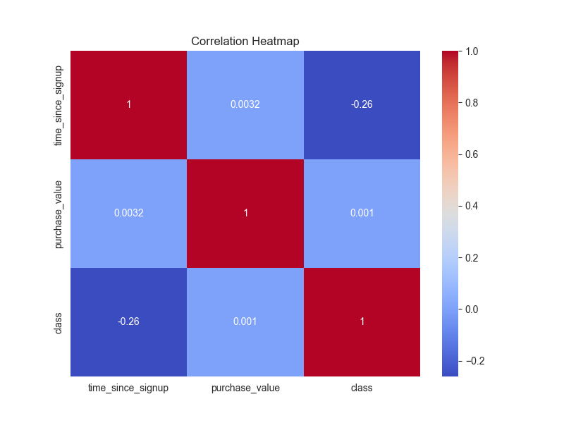
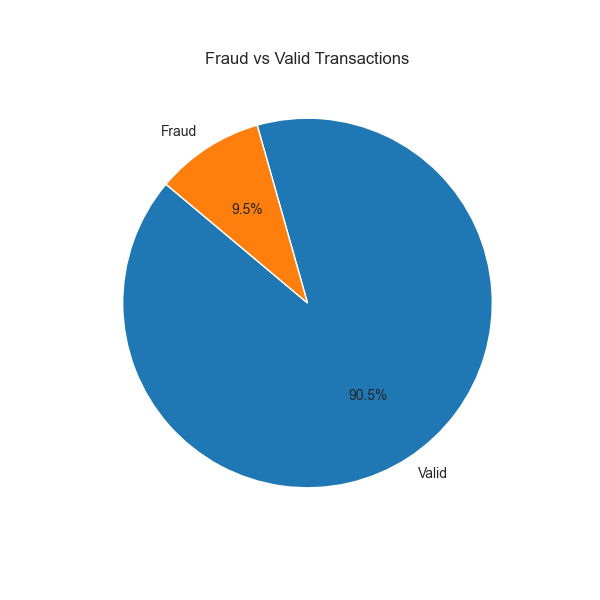

# 🚀 Ecommerce Banking Fraud Detection ML Project

[](https://www.python.org/)
[](https://pandas.pydata.org/)
[]()
[](LICENSE)

## 📋 Project Background

This project develops a machine learning model to detect fraudulent transactions in ecommerce banking systems. By analyzing user behavior, temporal patterns, and geolocation data, it addresses the critical business need to minimize financial losses from fraud, enhancing security and trust.

## 📁 Directory Structure

```
.
├── .github/
│   └── workflows/
│       └── unittests.yml
├── .gitignore
├── .vscode/
│   └── settings.json
├── LICENSE
├── README.md
├── data/
│   ├── processed/
│   │   └── .gitkeep
│   └── raw/
│       ├── .gitkeep
│       ├── creditcard.csv
│       ├── Fraud_Data.csv
│       └── IpAddress_to_Country.csv
├── images/
│   └── .gitkeep
├── models/
│   └── .gitkeep
├── notebooks/
│   ├── README.md
│   ├── eda-creditcard.ipynb
│   ├── eda-fraud-data.ipynb
│   ├── feature-engineering.ipynb
│   ├── modeling.ipynb
│   └── shap-explainability.ipynb
├── requirements.txt
├── scripts/
│   ├── __init__.py
│   └── README.md
├── src/
│   ├── __init__.py
│   └── preprocessing.py
└── tests/
    ├── __init__.py
```

## 🔍 Deep Analysis

### EDA Insights
- **Class Imbalance:** Severe skew with ~90% valid transactions.
- **Temporal Patterns:** Fraud peaks at certain hours and shortly after signup.
- **Geographic Risks:** Top countries include China and the US.

<details>
<summary>📊 View Correlation Heatmap</summary>

</details>

<details>
<summary>🥧 Fraud Distribution Pie Chart</summary>

</details>

## 🛠 Installation

1. Clone the repo: `git clone <repo-url>`
2. Install dependencies: `pip install -r requirements.txt`
3. Run notebooks in `notebooks/` for analysis.