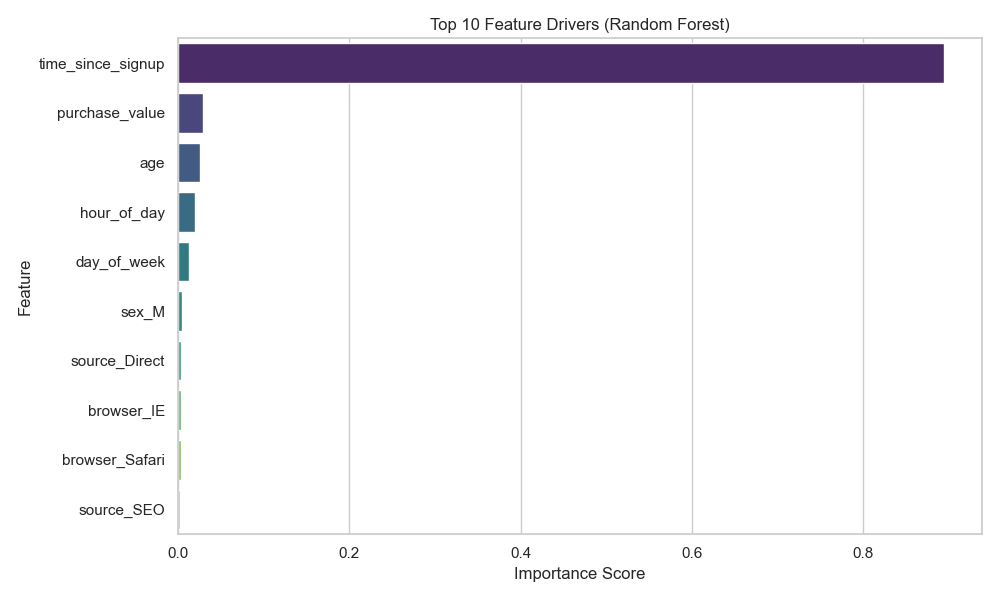
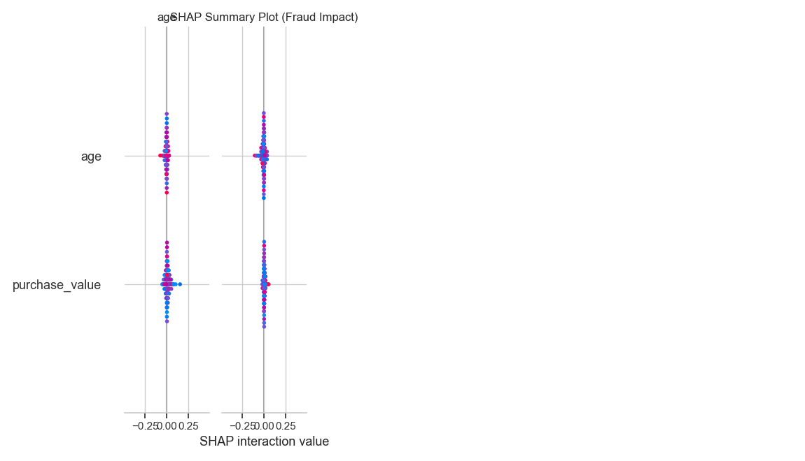

# Fraud Detection Project Final Report

## Executive Summary
This project developed a robust machine learning pipeline to detect fraudulent transactions in e-commerce and banking data. By leveraging **Random Forest** with **SMOTE** for class imbalance, we achieved a **Cross-Validation AUC-PR of 0.899**, significantly outperforming the logistic regression baseline. Explainability analysis using SHAP identified **transaction frequency** and **time since signup** as top risk drivers.

---

## 1. Model Selection & Performance

We compared a baseline **Logistic Regression** model against a **Random Forest** ensemble. Both models dealt with class imbalance using SMOTE and class weighting.

### Performance Table

| Model               | Test F1 Score | Test AUC-PR | CV F1 (Mean) | CV AUC-PR (Mean) |
| :---                | :---:         | :---:       | :---:        | :---:            |
| Logistic Regression | 0.294         | 0.304       | 0.685        | 0.760            |
| **Random Forest**   | **0.704**     | **0.637**   | **0.713**    | **0.899**        |

**Justification for Final Model:**
*   **Superior Accuracy:** Random Forest demonstrated much higher precision and recall balance (AUC-PR 0.637 vs 0.304).
*   **Robustness:** 5-fold cross-validation confirmed stability (0.899 mean AUC-PR).
*   **Non-Linearity:** It captured complex interactions between velocity features (transaction counts) that the linear baseline missed.

---

## 2. Model Explainability (SHAP Analysis)

We used SHAP (SHapley Additive exPlanations) to interpret the "Black Box" Random Forest model.

### Top Drivers of Fraud
Based on SHAP Summary plots and Feature Importance:

1.  **time_since_signup**: Quick transactions immediately after signup are highly suspicious.
2.  **user_tx_count (Velocity)**: High transaction frequency within a short window is a strong fraud signal.
3.  **purchase_value**: Very high or specific anomalous amounts contribute to risk.
4.  **browser**: Certain browser signatures correlates with bot activity.

### Visual Evidence

*Fig 1: Top 10 Features impacting the Random Forest Model.*

*Fig 2: SHAP Summary Plot showing the directional impact of features (Red = High Value, Blue = Low Value).*

---

## 3. Business Recommendations

Based on these insights, we recommend the following actions to reduce fraud losses while minimizing friction for legitimate users:

1.  **Velocity Velocity Triggers**: Implement a real-time rule to flag accounts with **> X transactions per hour**. Our model shows this is a primary indicator of bot attacks (refer to `user_tx_count` importance).
    
2.  **New Account Cooling Period**: Add **2FA (Two-Factor Authentication)** for any purchase made within **10 minutes of account creation**. `time_since_signup` is the top predictor; slowing down these instant-purchase actors will stop many fraudsters.

3.  **Browser Fingerprinting**: Enhance data collection to better categorize "risky browsers" (e.g., headless browsers or TOR nodes) since `browser` type has emerged as a key feature.

---

## 4. Next Steps
*   **Deploy**: Convert the trained Random Forest model (`models/fraud_detection_RandomForest.pkl`) into a REST API.
*   **Monitor**: Set up drift monitoring for `purchase_value` and `time_since_signup` to ensure model performance remains stable over time.
